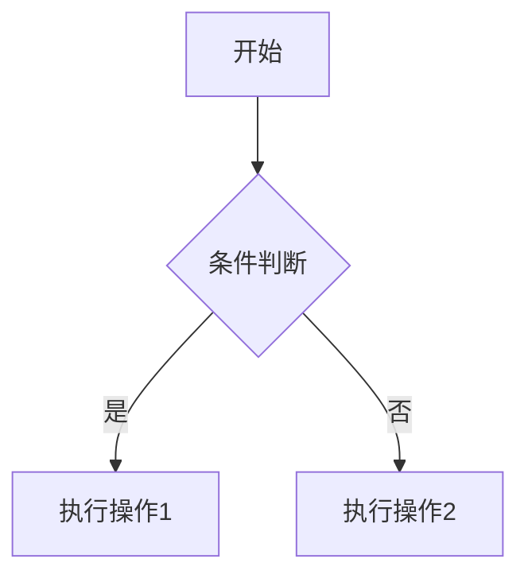

# 文档标题
> 一句话描述文档核心内容，建议包含关键词。  
> 例如：本文介绍Markdown的进阶用法，包含表格、流程图、公式等高级排版技巧。

---

## 目录（自动生成）
- [一、代码块](#一代码块)
- [二、表格](#二表格)
- [三、任务列表](#三任务列表)
- [四、流程图](#四流程图)
- [五、数学公式](#五数学公式)
- 

---

## 一、代码块
### 语法高亮示例
```python
def hello_world():
    print("Hello, Markdown!")
```

### 行内代码
使用`print()`函数输出内容。

---

## 二、表格
| 语法          | 效果          | 适用场景         |
|---------------|---------------|------------------|
| `**加粗**`    | ​**加粗**      | 强调重点内容     |
| `*斜体*`      | *斜体*        | 引用术语或外文   |
| `` `代码` ``  | `代码`        | 展示命令或参数   |

---

## 三、任务列表
- [x] 完成基础语法学习
- [ ] 练习流程图绘制
- [ ] 掌握LaTeX公式

---

## 四、流程图（需支持Mermaid）


---

## 五、数学公式
行内公式：$E=mc^2$

块级公式：
$$
\sum_{i=1}^{n} i = \frac{n(n+1)}{2}
$$

---

## 附件
- [示例文件下载](./demo.zip)  
- [外部链接](https://example.com)

> 最后更新：2023年10月  
> 维护者：@你的名字

## 八、基本格式
### 标题层级
```markdown
# 一级标题（建议每文件仅1个）
## 二级标题
### 三级标题
#### 四级标题（尽量少用）
```

### 段落与换行
这是第一段，末尾需要**空两格**再换行（兼容性更好）  
这是第二段，直接空一行更清晰。

### 强调与分割
强调与分割
如果需要强制换行，  
在行尾加两个空格。

### 字体形态
**加粗**、*斜体*、~~删除线~~、==高亮==（部分解析器支持）


### 分割线用三个减号（上下空行）
---

### 折叠内容（GitHub风格）
<details>
<summary>点击展开详细步骤</summary>
1. 第一步
2. 第二步
3. 第三步
</details>

### 注释写法（不会渲染）
[//]: # (这是单行注释，不会显示在渲染结果中)
[comment]: # (多行注释写法
              兼容性更好)

### 徽章标签（GitHub风格）


